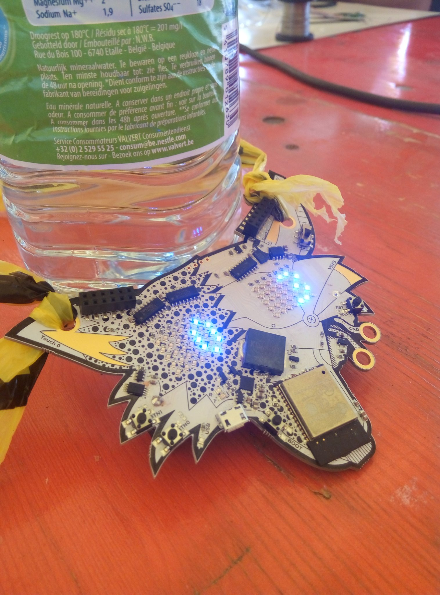

Simplified BLE Beacon for Fri3dCamp Badge
=========================================

Bluetooth BLE beacon and scanner based on the ESP32, badge for Fri3dcamp. It
counts the number of similar badges around. #esp32 #Bluetooth #fri3dcamp 

Taken from the Arduino example, and simplified.

Picture
=======

Todo
====

* Find out how to decrease the TX power of the Beacon, right now it goes too far (around 100m measured)
* Docker container to flash with arduino-cli

Links
=====

* Link to original source code of Arduino BLE here
